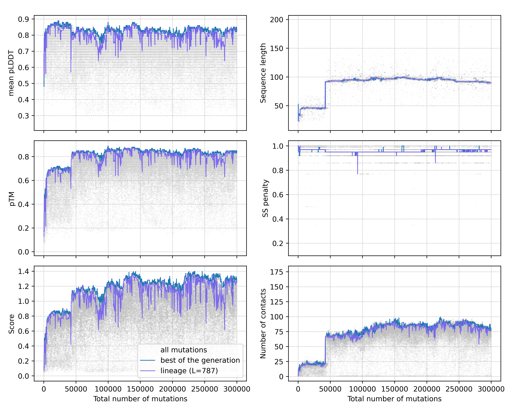

# PFES: protein fold evolution simulation

Code for [In silico evolution of globular protein folds from random sequences](https://www.pnas.org/doi/10.1073/pnas.2509015122)


### Installation and usage examples 
```
wget https://github.com/sahakyanhk/PFES/archive/refs/heads/alpha.zip -O pfes-alpha.zip; unzip pfes-alpha.zip

python pfes-alpha/pfes.py -h

#run a simulation starting from random peptides and analyse results 
python pfes-alpha/pfes.py  -ng 100 -ps 50 -sm weak -em single_chain -iseq random --random_seq_len 24 -o pfes_test_random 
python pfes-alpha/visual_pfes.py -l pfes_test_random/progress.log -s pfes_test_random/structures/ -o pfes_test_random/ 

#run a simulation starting from polyalanine 
python pfes-alpha/pfes.py  -ng 100 -ps 50 -sm weak -em single_chain -iseq AAAAAAAAAAAAAAAAAAAAAAAA -o pfes_test_polyA

```
<p align="center">
  
  
</p>

### Extended data
[](https://doi.org/10.5281/zenodo.14061036)


### Hardware requirements 
This code requires [ESMfold](https://github.com/facebookresearch/esm) to run. 

PFES was tested on Rocky Linux 8.7 (Green Obsidian) with NVIDIA Tesla V100 and A100 GPUs. 


